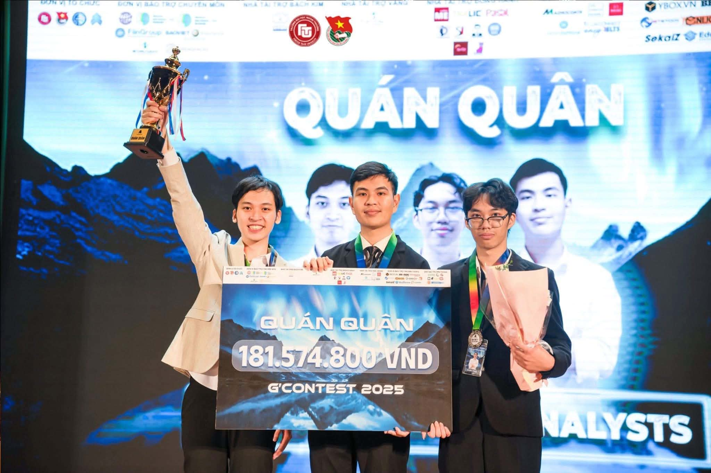

<div align="center">


# Digital Banking Customer Attrition

### Champion Solution - G'Contest 2025

[](assets/documents/champion-certificate.pdf)
[](#my-contribution)
[](#business-problem)
[](#modeling-results)

[View Final Presentation](assets/documents/final-presentation.pdf) |
[View Certificate](assets/documents/champion-certificate.pdf) |
[Explore the Notebook](notebooks/digital-banking-attrition-analysis.ipynb)

</div>

## Executive Summary

This repository presents the winning solution developed by **Tomorrow Data
Analysts** for G'Contest 2025, a national data analytics competition in
Vietnam with more than 300 participating teams.

We studied a digital bank's onboarding funnel to identify why customers
abandoned account registration and how the bank could intervene. The work
combined exploratory analysis, behavioral feature engineering, tree-based
classification, SHAP explainability, and survival analysis. Our selected
XGBoost model achieved a cross-validated **ROC-AUC of 0.8943** for customer
drop-off prediction.

The project went beyond model performance. We translated the evidence into a
redesigned onboarding journey focused on OCR and OTP reliability, accessible
support for older customers, device compatibility, and stronger customer
motivation.

## Business Problem

Digital onboarding is the bank's primary customer acquisition gateway, but
failed and abandoned applications waste marketing spend and weaken the first
customer experience.

The analysis addressed four questions:

1. Where do customers fail or leave the onboarding journey?
2. Which behavioral, demographic, temporal, and device factors are associated
   with drop-off?
3. Can the bank identify customers at risk before their final attempt?
4. Which product and operational changes should be prioritized?

Read the rewritten [problem statement](docs/problem-statement.md). Original
competition briefs and raw data are excluded for confidentiality.

## Key Findings

| Finding | Result |
|---|---:|
| Customers observed | 9,148 |
| Successful onboarding rate | 93% |
| Customers who dropped off | 600+ |
| Estimated acquisition value at risk | approximately VND 4.8 billion |
| Share of failures concentrated in OCR and OTP | approximately 80% |
| Best drop-off model | XGBoost |
| Cross-validated ROC-AUC | **0.8943** |

The financial value is an estimate based on the customer acquisition cost
assumption used in the competition proposal, not realized accounting loss.

## My Contribution

**Role: Team Leader & Modeler**

- Set the analytical direction and converted the broad case into testable
  business questions.
- Coordinated the team's workload, synthesis, and final decision-making.
- Designed customer-level behavioral and historical features for modeling.
- Built and compared XGBoost, LightGBM, and Random Forest classifiers.
- Evaluated models with stratified cross-validation and imbalance-aware
  metrics, selecting ROC-AUC as the primary comparison metric.
- Used SHAP and survival analysis to connect model output with interpretable
  customer behavior.
- Translated analytical findings into product, UI/UX, marketing, and
  operational recommendations.
- Led the team through the final presentation and defense that earned the
  Champion title.

## Analytical Workflow


The complete design rationale is documented in
[Methodology](docs/methodology.md).

## Modeling Results

The final-attempt drop-off models were evaluated using stratified
cross-validation:

| Model | ROC-AUC | Accuracy | F1 | Precision | Recall |
|---|---:|---:|---:|---:|---:|
| **XGBoost** | **0.8943** | 0.9287 | **0.5462** | 0.4742 | **0.6463** |
| LightGBM | 0.8927 | 0.9303 | 0.5442 | 0.4808 | 0.6281 |
| Random Forest | 0.8907 | **0.9351** | 0.5255 | **0.5100** | 0.5438 |

XGBoost was selected because it produced the strongest ROC-AUC and recall,
which better supported risk prioritization than accuracy alone in an
imbalanced problem.

Separate models attempting to predict the exact failure step achieved only
about **0.5-0.6 ROC-AUC**. We therefore treated their feature importance as
exploratory evidence rather than production-ready causal conclusions.

## Recommendations

- **Fix the highest-impact friction first:** improve OCR guidance, image quality
  feedback, OTP delivery, retry handling, and error recovery.
- **Design for accessibility:** add clearer instructions and assisted paths for
  older customer groups.
- **Detect device limitations early:** check OS, camera, and NFC compatibility
  before customers reach a blocking step.
- **Preserve customer progress:** allow safe resume and contextual recovery
  instead of forcing a restart.
- **Increase motivation to finish:** pair product improvements with targeted,
  measurable incentives.
- **Validate through experimentation:** roll out changes with funnel
  instrumentation and controlled A/B tests.

See [Business Recommendations](docs/business-recommendations.md) for the
prioritization and measurement framework.

## Technology Stack

`Python` · `pandas` · `NumPy` · `Matplotlib` · `Seaborn` · `scikit-learn` ·
`XGBoost` · `LightGBM` · `SHAP` · `lifelines` · `Jupyter Notebook`

## Repository Guide

```text
assets/
  documents/   Final presentation and Champion certificate
  images/      Competition and award photographs
docs/
  problem-statement.md
  methodology.md
  business-recommendations.md
notebooks/
  digital-banking-attrition-analysis.ipynb
```

The public notebook is a cleaned, data-independent portfolio artifact. It
documents the reproducible analytical design and reported results without
exposing the competition dataset.

## Gallery

<div align="center">
  
  <p><em>Tomorrow Data Analysts receiving the G'Contest 2025 Champion award.</em></p>
</div>

## Data Confidentiality

The raw dataset, organizer booklets, original case brief, and working notebook
are intentionally excluded. Public materials contain only rewritten problem
context, aggregated findings, methodology, and award evidence. This repository
must not be interpreted as a release of the competition data.

## Contact

**Anh Khanh**  
Team Leader & Modeler  
GitHub: [@ankhanhwork](https://github.com/ankhanhwork)

---

If this project is useful, consider starring the repository. It helps this
work reach other people interested in applied data science and digital
banking.
