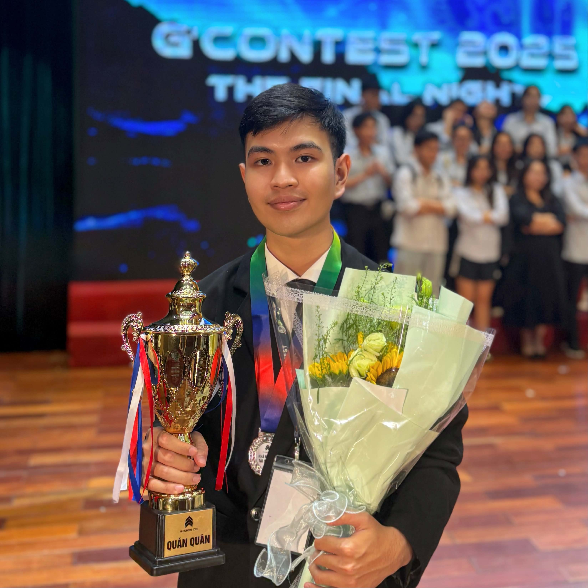
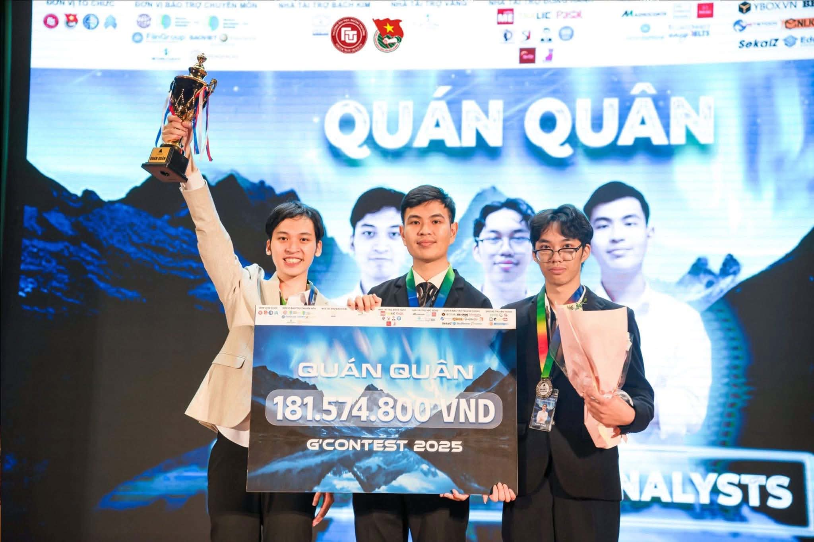

<div align="center">



# Digital Banking Customer Attrition

### Champion Solution - G'Contest 2025

[](assets/documents/champion-certificate.pdf)
[](#my-contribution)
[](#business-problem)
[](#modeling-results)

[View Final Presentation](assets/documents/final-presentation.pdf) |
[View Certificate](assets/documents/champion-certificate.pdf) |
[Explore the Notebooks](notebooks/README.md)

</div>

## Executive Summary

This repository presents the winning solution developed by **Tomorrow Data
Analysts** for G'Contest 2025, a national data analytics competition in
Vietnam with more than 300 participating teams.

We studied a digital bank's onboarding funnel to identify why customers
abandoned account registration and how the bank could intervene. The work
combined exploratory analysis, behavioral feature engineering, tree-based
classification, and SHAP explainability. Our selected XGBoost model achieved
a cross-validated **ROC-AUC of 0.9090** for customer drop-off prediction.

The project went beyond model performance. We translated the evidence into a
redesigned onboarding journey focused on OCR and OTP reliability, accessible
support for older customers, device compatibility, and stronger customer
motivation.

## Business Problem

Digital onboarding is the bank's primary customer acquisition gateway, but
failed and abandoned applications waste marketing spend and weaken the first
customer experience.

The analysis addressed four questions:

1. Where do customers fail or leave the onboarding journey?
2. Which behavioral, demographic, temporal, and device factors are associated
   with drop-off?
3. Can the bank identify customers at risk before their final attempt?
4. Which product and operational changes should be prioritized?

Read the rewritten [problem statement](docs/problem-statement.md). The raw
dataset is not included in this public portfolio repository.

## Key Findings

| Finding | Result |
|---|---:|
| Customers observed | 9,148 |
| Successful onboarding rate | 93% |
| Customers who dropped off | 600+ |
| Estimated acquisition value at risk | approximately VND 4.8 billion |
| Share of failures concentrated in OCR and OTP | approximately 80% |
| Best drop-off model | XGBoost |
| Cross-validated ROC-AUC | **0.9090** |

The financial value is an estimate based on the customer acquisition cost
assumption used in the competition proposal, not realized accounting loss.

## My Contribution

**Role: Team Leader & Modeler**

- Set the analytical direction and converted the broad case into testable
  business questions.
- Coordinated the team's workload, synthesis, and final decision-making.
- Designed customer-level behavioral and historical features for modeling.
- Built and compared XGBoost, LightGBM, Random Forest, and CatBoost
  classifiers.
- Evaluated models with stratified cross-validation and imbalance-aware
  metrics, balancing ROC-AUC with F1, precision, and recall.
- Used SHAP to connect model output with interpretable customer behavior.
- Translated analytical findings into product, UI/UX, marketing, and
  operational recommendations.
- Led the team through the final presentation and defense that earned the
  Champion title.

## Analytical Workflow


```mermaid
flowchart LR
    A["Business framing"] --> B["Data quality and cleaning"]
    B --> C["Journey and cohort EDA"]
    C --> D["Behavioral feature engineering"]
    D --> E["XGBoost, LightGBM, Random Forest, CatBoost"]
    E --> F["Cross-validation and model selection"]
    F --> G["SHAP explainability"]
    G --> H["Product and business actions"]
```

The complete design rationale is documented in
[Methodology](docs/methodology.md).

## Modeling Results

The final-attempt drop-off models were evaluated using stratified
cross-validation:

| Model | ROC-AUC | Accuracy | F1 | Precision | Recall |
|---|---:|---:|---:|---:|---:|
| **XGBoost** | 0.9090 | 0.9207 | **0.5294** | 0.4380 | 0.6711 |
| LightGBM | **0.9105** | 0.9053 | 0.5120 | 0.3897 | **0.7488** |
| Random Forest | 0.9074 | **0.9267** | 0.5137 | **0.4593** | 0.5851 |
| CatBoost | 0.9050 | 0.9089 | 0.5091 | 0.3974 | 0.7107 |

LightGBM produced the highest ROC-AUC by a narrow margin of about 0.0015, but
XGBoost was selected as the final model because it delivered the strongest
F1-score and a more balanced precision-recall trade-off. In this imbalanced
drop-off problem, that balance mattered more than optimizing ROC-AUC alone:
the model still needed to surface at-risk customers while keeping the alert
quality credible for business follow-up.

The XGBoost SHAP summary showed that **age** was the strongest model signal.
Historical friction signals were also prominent, especially prior pending or
failed activity around contract rejection, OTP, check failure, OCR, and the
customer's cumulative number of attempts. Device brand and time-context
features contributed as secondary signals. These patterns were treated as
model associations to guide investigation and intervention design, not as
standalone causal proof.

## Recommendations

- **Fix the highest-impact friction first:** improve OCR guidance, image quality
  feedback, OTP delivery, retry handling, and error recovery.
- **Design for accessibility:** add clearer instructions and assisted paths for
  older customer groups.
- **Detect device limitations early:** check OS, camera, and NFC compatibility
  before customers reach a blocking step.
- **Preserve customer progress:** allow safe resume and contextual recovery
  instead of forcing a restart.
- **Increase motivation to finish:** pair product improvements with targeted,
  measurable incentives.
- **Validate through experimentation:** roll out changes with funnel
  instrumentation and controlled A/B tests.

See [Business Recommendations](docs/business-recommendations.md) for the
prioritization and measurement framework.

## Technology Stack

`Python` · `pandas` · `NumPy` · `Matplotlib` · `Seaborn` · `scikit-learn` ·
`XGBoost` · `LightGBM` · `CatBoost` · `SHAP` · `Jupyter Notebook`

## Repository Guide

```text
assets/
  documents/   Final presentation and Champion certificate
  images/      Competition and award photographs
docs/
  problem-statement.md
  methodology.md
  business-recommendations.md
notebooks/
  README.md
  01-business-data-eda.ipynb
  02-preprocessing-dropoff-modeling.ipynb
```

The notebooks are split from the original working notebook so GitHub can
render each stage faster. Raw data and data-loading code are excluded, while
saved outputs are preserved for review during interviews. The public notebook
scope focuses on business framing, EDA, preprocessing, final-attempt drop-off
modeling, and XGBoost SHAP interpretation.

## Gallery

<div align="center">
  
  <p><em>Tomorrow Data Analysts receiving the G'Contest 2025 Champion award.</em></p>
</div>

## Data Availability

The raw competition dataset is not uploaded to this repository. The split
notebooks are intended as a portfolio walkthrough: they keep the completed
outputs, charts, and model results visible without requiring reviewers to rerun
private data-loading steps.

## Contact

**An Khanh**<br>
Team Leader & Modeler<br>
GitHub: [@ankhanhwork](https://github.com/ankhanhwork)

---

If this project is useful, consider starring the repository. It helps this
work reach other people interested in applied data science and digital
banking.
